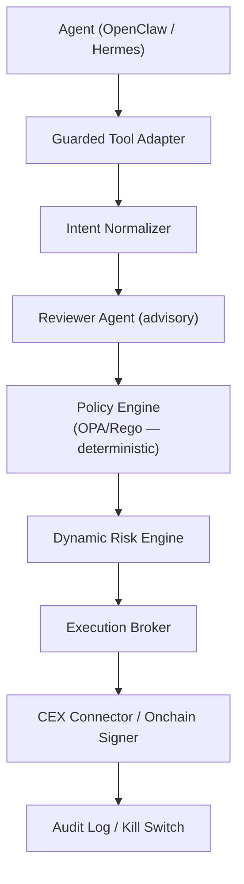

# Agent Trading Guardrails

A TypeScript-based guardrails framework that lets AI trading agents (OpenClaw, Hermes Agent) propose trading actions on centralized exchanges and onchain protocols while keeping execution, policy, secrets, signing, network access, and auditability outside the agent runtime.

## Scope

- **Supported agents:** OpenClaw, Hermes Agent
- **CEX:** Binance spot and USD-M futures
- **Onchain:** Ethereum Sepolia (testnet), Solana devnet
- **Policy engine:** OPA/Rego for deterministic authorization
- **Reviewer:** LLM-based semantic review (advisory, not authoritative)
- **Secrets:** Vault or a production-grade secret manager for live profiles, local provider for development
- **Audit:** Hash-chained SQLite audit records; tamper evidence depends on protecting `AUDIT_HASH_SECRET` and any configured external hash anchor

## Non-Goals

- The agent runtime does not hold CEX API keys, wallet private keys, or direct exchange/RPC access.
- The reviewer agent verdict is advisory — it cannot sign, trade, approve secrets, or bypass policy.
- This is not a general-purpose trading platform. It is a security boundary between AI agents and financial execution.
- Margin lending, cross-margin, and COIN-M futures are excluded from the first scope.
- CEX withdrawals and account transfers are always denied.

## Architecture



See [docs/architecture.md](docs/architecture.md) for details.

## Prerequisites

- Node.js >= 22
- pnpm (via Corepack: `corepack enable`)
- Docker (for OPA sidecar and local development)

## Getting Started

```bash
corepack enable
pnpm install
cp env.example .env

# Run tests
pnpm test

# Lint and typecheck
pnpm lint
pnpm typecheck
```

## Security

**Real API keys, wallet private keys, seed phrases, and other secrets must never be committed to this repository.** Use the `env.example` file as a template and store actual secrets in `.env` (gitignored) or a secret manager.

See [docs/security-boundaries.md](docs/security-boundaries.md) for the full security model.
